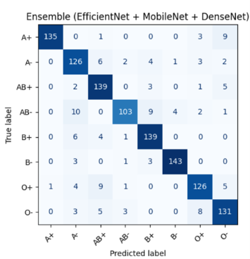

# Results – Blood Group Classification from Fingerprints

## Overview
We evaluated multiple CNN architectures (ResNet50, DenseNet121, MobileNetV2, EfficientNetB0) on fingerprint images combined with ridge pattern distributions (Arch, Loop, Whorl).  
A weighted ensemble of EfficientNetB0, DenseNet121, and MobileNetV2 achieved the best results.

---

## Hardware & Setup
- **CPU:** Intel i5-10400 @ 2.9 GHz  
- **GPU:** NVIDIA GeForce RTX 2050 (4GB)  
- **RAM:** 12GB  
- **Frameworks:** Python 3.8, TensorFlow 2.8, Keras, OpenCV 4.5, Albumentations  

---

## Dataset
- Source: Kaggle (8 blood groups: A⁺, A⁻, B⁺, B⁻, AB⁺, AB⁻, O⁺, O⁻)  
- Preprocessing: Noise reduction, sharpening, histogram equalization, resizing to 224×224.  
- Splitting: Stratified – 300 images per class for validation, 300 for test, rest for training.  

---

## Individual CNN Model Performance

| Model          | Accuracy | Macro F1-Score |
|----------------|----------|----------------|
| ResNet50       | 84%      | 0.84           |
| MobileNetV2    | 85%      | 0.85           |
| DenseNet121    | 84%      | 0.84           |
| EfficientNetB0 | **86%**  | **0.86**       |

---

## Ensemble Model (EfficientNetB0 + DenseNet121 + MobileNetV2)
- **Accuracy:** 89%  
- **F1-score:** 0.90  
- **Weights:** [0.34, 0.33, 0.33]  
- **Benefit:** Improved classification for low-support groups (A⁻, AB⁻).  

---

## Confusion Matrix

---

## Key Insights
- Feature-level fusion (fingerprint + ridge pattern distributions) improved discrimination.  
- Ensemble method reduced misclassification for visually similar groups (e.g., A⁻ vs AB⁻).  
- Statistical tests confirmed a **moderate correlation** between fingerprint ridge patterns and blood groups (Cramér’s V ≈ 0.31).  

---

## Conclusion
- **Ensemble model outperformed individual models**, achieving **89% accuracy** and strong balance across all blood groups.  
- The method is **lightweight, explainable, and deployable** on modest hardware, making it useful for **non-invasive diagnostics, forensic, and healthcare applications**.  
